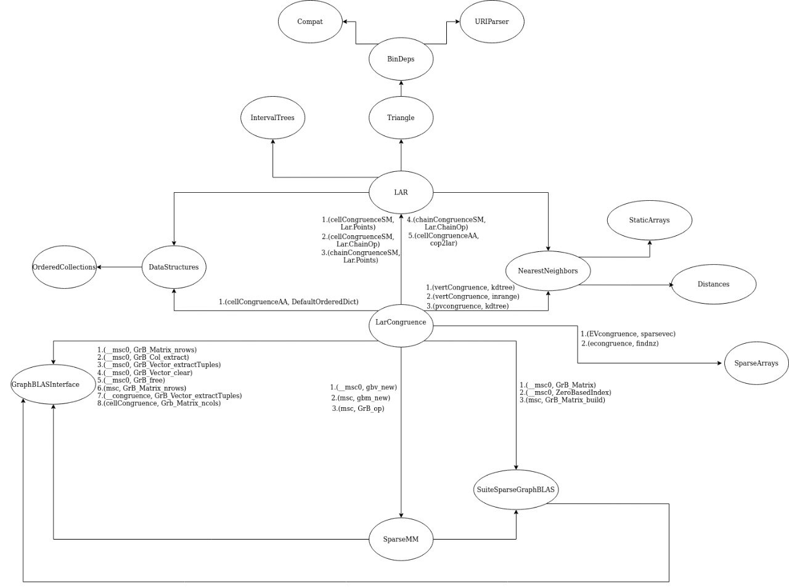

# Grafo delle dipendenze originale

In questa sezione è rappresentato il grafo orientato delle dipendenze.
Ogni arco orientato rappresenta una chiamata di funzione $(v_1, v_2)$, dove $v_1$ è la funzione chiamante, e $v_2$ è la funzione chiamata. I nodi hanno un’etichetta corrispondente al nome del package mentre gli archi hanno un elenco di etichette corrispondenti alle coppie $(v_1, v_2)$ precedentemente descritte.

## Come realizzare il grafo
Per quanto riguarda la costruzione del grafo, è stato utilizzato il package " [PkgDependency.jl](https://github.com/peng1999/PkgDependency.jl) ", il quale permette di ricavare tutte le dipendenze di un package e le va a mostrare sotto forma di albero. Successivamente, utilizzando le informazioni ottenute tramite il package, è stato creato il grafo sulla piattaforma online " [diagrams.net](https://app.diagrams.net/)", precedentemente nota come "draw.io".
