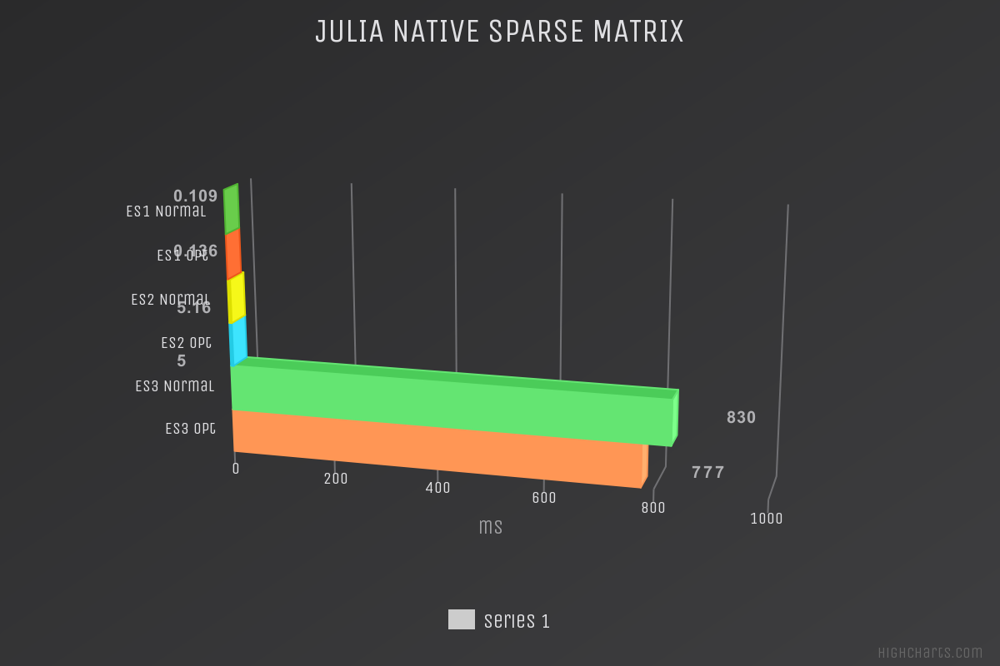
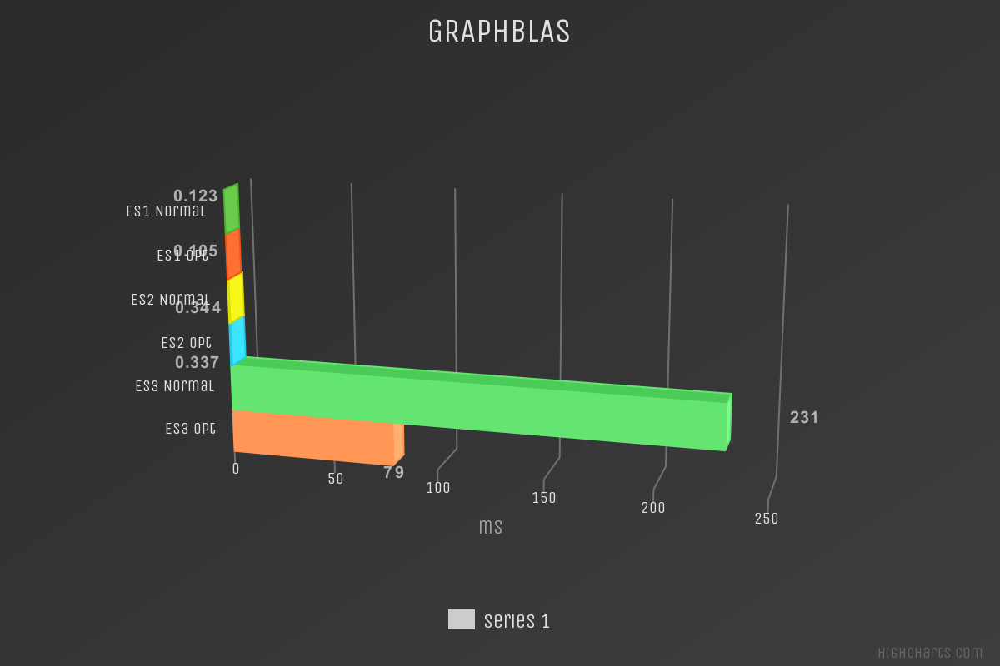
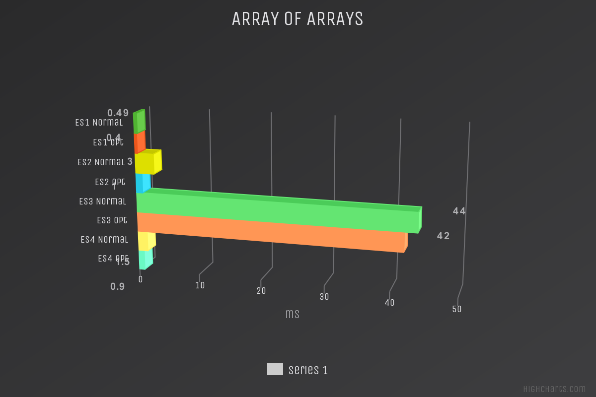

# Confronto versioni "chainCongruence() tra le varie implementazioni"
Sono stati utilizzati tre esempi, tutti diversi tra loro in quanto a dimensioni dell'input, in modo da poter verificare i cambiamenti di comportamento delle funzioni al loro variare. Ci si aspetta dunque un miglioramento più evidente sugli esempi di dimensioni maggiore, questo perché eseguire operazioni complesse come quelle utilizzate per la programmazione asincrona e/o parallela, su input di piccole dimensioni, in modo controintuitivo, può penalizzare le prestazioni, cosa che non accade per input più grandi.
1. Esempio 1 - input 3x24
2. Esempio 2 - input 3x432
3. Esempio 3 - input 1192x3

La funzione testata e di cui si mostrano i confronti tra i diversi risultati nelle sezioni seguenti è **"chainCongruence()"**, nelle sue diverse versioni SM, GB, AA, eseguendo il confronto di ciascuna tra la versione originale del codice e quella ottimizzata introducento la parallelizzazione.

Per la valutazione delle prestazioni è stata utilizzata la macro julia **@benchmark**, presente all'interno del package BenchmarkTools.jl, la quale va a eseguire la funzione testata un certo numero di volte, restituendo tempo medio di esecuzione (espresso in millisecondi o microsecondi) e lo spazio medio allocato (espresso in Mebibyte o Kibibyte), nei grafici seguenti vengono mostrati i tempi medi di esecuzione.

# Julia Native Sparse Matrix
L'implementazione SM non ha mostrato grandi miglioramenti; come detto in precedenza le differenze sono più evidenti nel terzo esempio in quanto è quello che presenta input di dimensioni maggiori. In questo esempio infatti si ha un miglioramento sui tempi di esecuzione di circa il 6%.
 
# GraphBLAS
L'implementazione GB è stata quella che ha risposto meglio alle modifiche, con evidenti miglioramenti in tutti gli esempi testati. Si nota infatti un netto miglioramento del 65% sui tempi di esecuzione, questo perché la funzione 'cellCongruence()' dell'implementazione GB si presta bene all'utilizzo dei threads.
 
# Array of Arrays
Anche l'implementazione AA ha ottenuto buoni risultati dopo le modifiche, si nota un miglioramento di quasi il 20% sui tempi di esecuzione del primo esempio e uno di circa il 5% sul terzo.
