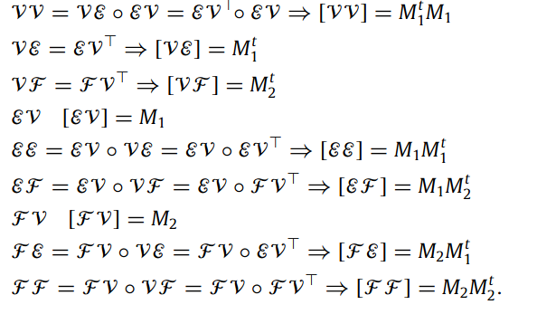

In questa sezione, verranno discussi gli step seguiti durante l'avanzamento del progetto.

# Studio preliminare
In questa prima fase, gli sforzi sono stati concentrati sullo studio della teoria di base legata intrinsecamente al progetto:
* Accezioni e nomenclature matematiche (es: monoidi, semirings, matrici sparse, ...)
* Studio delle strutture algebriche (es: celle, catene, cocatene, ...)
* Studio del linguaggio Julia (sintassi, funzioni, macro, ...)
* Concetti base sul funzionamento di GraphBLAS e funzioni Julia (SuiteSparseGraphBLAS e GraphBLASInterface)
* Concetti base sul funzionamento di Local Congruence (Sparse Matrix, Array of Arrays e GraphBLAS stesso)
Inoltre, ci si è concentrati sulla realizzazione di un buon grafo delle dipendenze.

# Studio esecutivo
Il secondo step racchiude il modo in cui sono stati modificate le funzioni dei progetti cea-SM.jl e cea-GB.jl, in modo tale da introdurre un buon grado di parallelismo e migliorare le prestazioni. Per fare ciò, sono state utilizzate le funzioni e le macro offerte da Julia che permettono di operare in modo parallelo tramite semplice annotazioni; i concetti chiave utilizzati sono:
* Threads
* Tasks
* Simd

## Modifiche effettuate
Ci si è concentrati sul migliorare la funzione "CellCongruence()" in entrambe le implementazioni (SM e GB): questa funzione ha l’obiettivo di verificare ed eseguire la congruenza di celle e complessi di celle tra la geometria e la topologia passate in input. Poiché questo processo può essere eseguito in modo indipendente faccia per faccia, risulta opportuno parallelizzare la funzione tramite le macro fornite da Julia. A tale scopo, sono state attuate le seguenti modifiche:
* Vertices Congruence: la funzione vertCongruence (dal file verticesCongruence.jl) `e stata modifica in vertCongruenceOptimized (nel file verticesCongruence-optimized.jl), aggiungendo l’utilizzo dei Tasks.
```julia
@sync for vidx = 1 : size(V, 2)
    @async begin
        if !(vidx in visited)
            nearvs = NearestNeighbors.inrange(kdtree, V[:, vidx], ϵ)
            push!(Vcls, nearvs)
            push!(visited, nearvs...)
        end
    end
end
```
* Sparse Matrix: 
    * la funzione chainCongruenceSM OPT(...) è stata migliorata sfruttando i Tasks;
    * la funzione cellCongruenceSM OPT(...) è stata migliorata sfruttando i Tasks e SIMD.
```julia
# chainCongruenceSM_OPT
@sync for d = 1 : length(T)
    @async Tn[d], cls, sign = cellCongruenceSM_OPT(T[d], cls, sign; imp=imp, d=d)
end


# cellCongruenceSM_OPT
...
@simd for i = 1 : length(lo_cls)
    col = sum([
        cop[:, lo_cls[i][j]] .* lo_sign[i][j]
        for j = 1 : length(lo_cls[i])
    ])
    push!(copCols, col)
end
...
@sync for row = 1 : cop.m
    if rows[row].nzval[1] > 0
        @async begin
            rows[row] = -rows[row]
            sign[row] = -1
        end 
    end
end
...
@simd for cidx = 1 : cop.m
    if rows[rows_ord[cidx]] != nrows[nidx]  
        nidx = nidx + 1;
    end
    push!(ho_cls[nidx], rows_ord[cidx])
end
...
```    
* GraphBLAS: Per quanto riguarda GraphBLAS, è stato scelto di implementare una sola modifica, per non penalizzare le performance: sono stati usati i Thread (in particolare 6, siccome la macchina utilizzata dispone di una CPU con 6 core) per eseguire la funzione cellCongruence_OPT(...)
```julia
@threads for i in eachindex(Topn)
	Topn[i], cls = cellCongruence_OPT(Top[i], cls)
end
```


# Studio definitivo
Per lo studio definitivo sono state apportate diverse modifiche:
* Innanzitutto, è stato modificato il file ce-AA.jl per migliorare i tempi di esecuzione delle funzioni dell'implementazione Array of Arrays, seguendo lo stesso approccio utilizzato durante lo studio esecutivo (macro julia @async, @sync)
```julia
# vertCongruenceAA_OPT
for vi in 1:size(verts,2)
	@async begin 
		if !(vi in todelete)
			nearvs = NearestNeighbors.inrange(kdtree, verts[:,vi], err)
			push!(vclasses,nearvs)
			newverts[nearvs] .= i
			nearvs = setdiff(nearvs, vi)
			todelete = union(todelete, nearvs)
			i += 1
		end
	end
end
...
for (k,class) in enumerate(vclasses)
	@async V[:,k] = sum(W[class,:],dims=1)/length(class)
end
...

# cellCongruenceAA_OPT
...
for (k,class) in enumerate(inclasses)
	@async for e in class
		new_e[e] = k
	end
end
...
@sync for (k,face) in enumerate(cells)
    @async begin
        if outclasses[face] == []
            outclasses[face] = [k]
        else
            append!(outclasses[face],[k])
        end
    end
end
```    
* Sono stati successivamente studiati i package **Images.jl** e **Plots.jl**, utili per visualizzare graficamente matrici e matrici sparse, in modo da poter confrontare in modo visuale e in breve tempo gli output ottenuti tra le diverse versioni delle funzioni, così da poter verificare la loro correttezza. Le funzioni utilizzate per fare ciò sono state 'colorview' del package Images e 'spy' del package Plots.

* È stato aggiunto un nuovo esempio sfruttando la funzione **randomcubes()** presente all'interno del package LinearAlgebraicRepresentation.jl (LAR): tramite questa funzione è possibile generare dei cubi, in numero e dimensioni arbitrari, utilizzabili in esempi dinamici, poichè generati a runtime. Questo esempio risulta essere molto utile in quanto le dimensioni dell'input sono sufficientemente alte da poter verificare correttamente i miglioramenti di performance delle modifiche del codice (miglioramenti effettivamente ottenuti commentati in una prossima sezione della documentazione).

* Sono state generate le nove matrici di incidenza/adiacenza descritte nel paper "LAR-CAD2014-main"   
Ciò è stato fatto a partire dal risultato della funzione 'randomcubes', ottenendo le matrici EV e FV e l'array dei vertici V; prese queste, è possibile ricavare tramite prodotto matriciale le seguenti sei matrici: VV, VE, EE, FE, EF, VF, FF. Il procedimento viene mostrato all'interno del notebook [[CPD22-7a]adjacencyMatrices.ipynb](https://github.com/Panemiele/LarCongruence.jl/blob/main/examples/notebooks/[CPD22-7a]adjacencyMatrices.ipynb)

* Molte funzioni in diverse implementazioni mancavano di opportune docstring; esse sono state quindi aggiunte per garantire maggiore leggibilità.


## Riferimenti
Per consultare il codice, si rimanda al link del repository [GitHub](https://github.com/Panemiele/LarCongruence.jl), mentre per uno studio approfondito delle varie macro di Julia sopracitate, verranno elencati i vari link della documentazione:
* [Threads](https://docs.julialang.org/en/v1/manual/multi-threading/)
* [Tasks](https://docs.julialang.org/en/v1/manual/asynchronous-programming/)
* [SIMD](https://docs.julialang.org/en/v1/manual/performance-tips/)